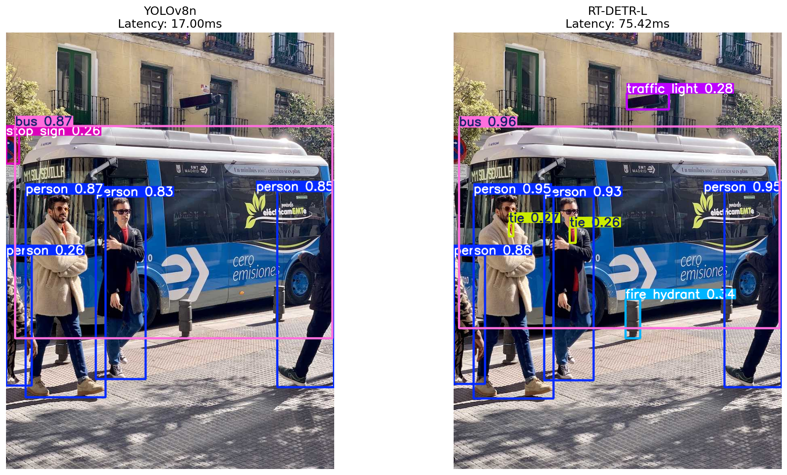
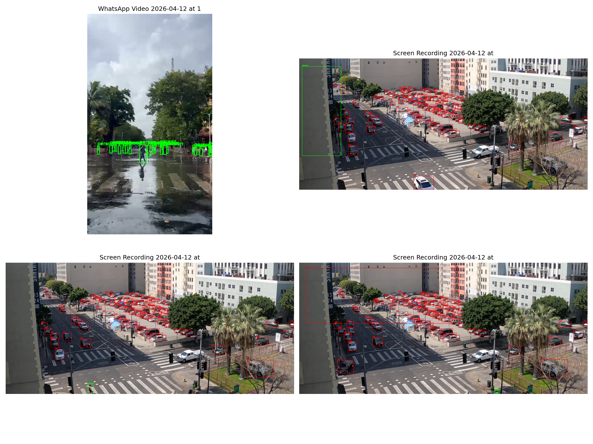

# SJSU CMPE 258: Deep Learning — Homework 2
## Traffic Object Detection

**Name:** Renuka Prasad Patwari  
**Course:** CMPE 258 — Deep Learning, San José State University  
**GPU:** Tesla T4 (Google Colab) · CUDA 13.0 · PyTorch 2.10.0+cu128 · Ultralytics 8.4.37

---

## What This Project Does

End-to-end traffic object detection system with two components:

**Backend** — FastAPI inference server (`/backend/app.py`) that:
- Loads all available model formats at startup (PyTorch `.pt`, ONNX `.onnx`, TensorRT `.engine`) and gracefully skips any that fail (e.g. TensorRT on CPU-only machines)
- Exposes three endpoints: single-model image detection, single-model video detection, and multi-model comparison
- Detects three traffic classes: **pedestrian**, **bicycle**, **car**
- Returns annotated images/video as base64 with bounding boxes, labels, and confidence scores

**Frontend** — Next.js app (`/frontend`) that:
- Drag-and-drop upload for images and video files
- Dynamically fetches available models from the backend and populates the dropdown
- Displays annotated results with latency badge (green < 50 ms, yellow 50–200 ms, red > 200 ms)
- Compare page runs all loaded models side-by-side in a 2×2 grid, highlighting fastest and most detections

---

## Demo

https://github.com/user-attachments/assets/f8d15ab5-52e1-4165-93a2-de3f197f425f

### Side-by-Side Model Comparison


### Dataset Annotation Verification


---

## Project Structure

```
ObjectDetection/
├── backend/
│   └── app.py              # FastAPI server
├── frontend/               # Next.js app
│   ├── app/
│   │   ├── page.js         # Main detection page (/)
│   │   └── compare/page.js # Compare page (/compare)
│   ├── components/
│   └── lib/api.js          # axios API client
├── models/                 # Model weights (generated by notebook)
│   ├── yolov8n.pt
│   ├── yolov8n.onnx
│   ├── yolov8n.engine
│   ├── rtdetr-l.pt
│   ├── rtdetr-l.onnx
│   └── rtdetr-l.engine
├── notebook/
│   └── Object_Detection.ipynb
├── results/
│   ├── comparison.png
│   ├── fixed_annotations.png
│   └── ObjectDetection_Demo.mov
└── requirements.txt
```

---

## How to Generate Models

Run the Colab notebook [`notebook/Object_Detection.ipynb`](notebook/Object_Detection.ipynb) end-to-end. It will:
1. Download `yolov8n.pt` and `rtdetr-l.pt` from Ultralytics
2. Export both to ONNX (`yolov8n.onnx`, `rtdetr-l.onnx`)
3. Export both to TensorRT FP16 (`yolov8n.engine`, `rtdetr-l.engine`) — requires NVIDIA GPU

Download the six model files from Colab and place them in the `models/` directory.


---

## How to Run the Backend

```bash
# From project root
pip install -r requirements.txt

cd backend
uvicorn app:app --host 0.0.0.0 --port 8001 --reload
```

The server prints which models loaded successfully at startup:
```
✅ Loaded yolov8_pytorch
✅ Loaded yolov8_onnx
⚠️  Skipping yolov8_tensorrt — requires NVIDIA GPU + TensorRT
✅ Loaded rtdetr_pytorch
✅ Loaded rtdetr_onnx
⚠️  Skipping rtdetr_tensorrt — requires NVIDIA GPU + TensorRT

🚀 Available models: ['yolov8_pytorch', 'yolov8_onnx', 'rtdetr_pytorch', 'rtdetr_onnx']
```

API docs available at `http://localhost:8001/docs`.

### Endpoints

| Method | Endpoint | Description |
|--------|----------|-------------|
| `GET` | `/models` | List loaded models |
| `POST` | `/detect/image?model_name=xxx` | Detect objects in an image |
| `POST` | `/detect/video?model_name=xxx` | Detect objects in a video (up to 300 frames) |
| `POST` | `/detect/compare` | Run all models on the same image |

---

## How to Run the Frontend

```bash
cd frontend
npm install
npm run dev
```

Open `http://localhost:3000`.

> Make sure the backend is running first. The frontend reads `NEXT_PUBLIC_API_URL` from `frontend/.env.local` (defaults to `http://localhost:8001`).

---

## Benchmark Results

Measured on **Tesla T4 GPU** (Google Colab), 20 inference runs per model after 3 warmup runs, on a 640×640 traffic image.

| Model | Latency (ms) | Std Dev | FPS |
|---|---:|---:|---:|
| YOLOv8 PyTorch | 13.79 | ±1.06 | 72.5 |
| **YOLOv8 TensorRT** | **10.72** | **±0.12** | **93.2** |
| YOLOv8 ONNX (CPU) | 132.25 | ±6.47 | 7.6 |
| RT-DETR PyTorch | 56.20 | ±3.94 | 17.8 |
| RT-DETR TensorRT | 16.36 | ±0.53 | 61.1 |
| RT-DETR ONNX (CPU) | 1275.87 | ±203.50 | 0.8 |

**Key observations:**
- TensorRT FP16 gives **1.3× speedup** for YOLOv8 (13.8 ms → 10.7 ms) and **3.4× speedup** for RT-DETR (56.2 ms → 16.4 ms), pushing it from near-real-time to 61 FPS
- ONNX Runtime on CPU is practical for YOLOv8 (7.6 FPS) but completely unsuitable for the transformer-based RT-DETR (0.8 FPS), showing that ONNX acceleration is architecture-dependent
- YOLOv8 TensorRT is the fastest overall; RT-DETR TensorRT offers the best accuracy-speed trade-off

---

## mAP Evaluation

Evaluated on the custom Roboflow traffic dataset (73 training images, 3,607 bounding boxes after polygon-to-bbox conversion) at `conf=0.25`, `iou=0.5`, `imgsz=640`.

### Overall

| Metric | YOLOv8n | RT-DETR-L |
|---|---:|---:|
| **mAP50** | 0.240 | **0.426** |
| **mAP50-95** | 0.135 | **0.292** |
| Precision | **0.829** | 0.669 |
| Recall | 0.252 | **0.453** |
| Inference speed | **14 ms** | 56 ms |

### Per-Class — YOLOv8n

| Class | Precision | Recall | mAP50 | mAP50-95 |
|---|---:|---:|---:|---:|
| pedestrian | 0.807 | 0.341 | 0.328 | 0.195 |
| bicycle | 0.895 | 0.243 | 0.241 | 0.118 |
| car | 0.786 | 0.172 | 0.152 | 0.091 |
| **all** | **0.829** | **0.252** | **0.240** | **0.135** |

### Per-Class — RT-DETR-L

| Class | Precision | Recall | mAP50 | mAP50-95 |
|---|---:|---:|---:|---:|
| pedestrian | 0.480 | 0.577 | 0.511 | 0.303 |
| bicycle | 0.694 | 0.519 | 0.497 | 0.400 |
| car | 0.834 | 0.262 | 0.269 | 0.174 |
| **all** | **0.669** | **0.453** | **0.426** | **0.292** |

### Analysis

**RT-DETR-L wins on accuracy.** Its mAP50 of 0.426 vs YOLOv8n's 0.240 makes it ~77% more accurate at localizing objects. The mAP50-95 gap (0.292 vs 0.135) holds even with stricter localization requirements.

**YOLOv8n wins on precision.** At 82.9% it generates fewer false alarms than RT-DETR's 66.9%, making it preferable when false positives carry a cost.

**Both models struggle with recall** on this small dataset — YOLOv8 misses 75% of objects, RT-DETR misses 55%. The car class is hardest for both models (dense, occluded vehicles dominate the 3,121 car annotations).
